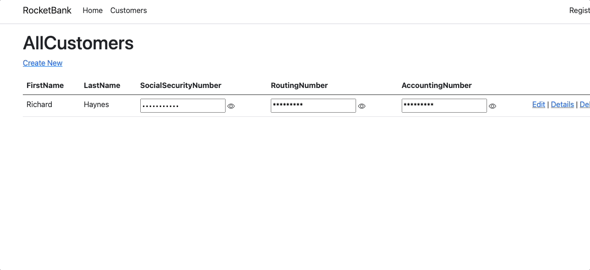

# Data Masking
As with all sections in this project we are going to cover a topic where Javascript is a very useful and simple option for developers and that is data masking. So for those not familar with the term data masking is simply when a user interface obscures or "masks" senstive information such as passwords, social security numbers, etc. NOTE: while the concept is similar in purpose, masking is not a form of encrpytion. Encryption is a procress where an algorithim of some type uses a key to obfuscate or purposefully obscure some information. A key of some sort is critical in encryption where masking is often times triggered by much simplier means such as pressing a button or check box. 

While not as secure as encryption masking is a very valuable security technique as it's mainly used to make "Shoulder Surfing" more difficult. For those not familar "shoulder surfing" is simply when an attacker merely finds a person who has access to sensitive information which can be used in an attack and simply hovers over that persons screen to either remember or take pictures of information needed. The best encryption in the world has no effect when a user who should be able to see something merely has all that information present on their screens for everyone to see. 

## Use Case
So in our test case we are going to be building a system that registers users of a bank. As part of that registration we will ask them to provide 3 pieces of information that will fall into the categories of sensitive and personal identifiable information, a social security number and a user's routing and accounting number for our bank. We have some back end C# code that will handle encrypting this data but we do need the data avaliable to be seen by bank employees of appropriate priviledge. 

Below is a cshtml file called AllCustomers that will display the bank's customers data. This file will be modified by our site.js file to unmask information.
```C#
@page
@model RocketBank.Pages.AllCustomersModel

@{
    ViewData["Title"] = "AllCustomers";
}

<h1>AllCustomers</h1>

<p>
    <a asp-page="Create">Create New</a>
</p>
<table class="table">
    <thead>
        <tr>
            <th>
                @Html.DisplayNameFor(model => model.Customers[0].FirstName)
            </th>
            <th>
                @Html.DisplayNameFor(model => model.Customers[0].LastName)
            </th>
            <th>
                @Html.DisplayNameFor(model => model.Customers[0].SocialSecurityNumber)
            </th>
            <th>
                @Html.DisplayNameFor(model => model.Customers[0].RoutingNumber)
            </th>
            <th>
                @Html.DisplayNameFor(model => model.Customers[0].AccountingNumber)
            </th>
            <th></th>
        </tr>
    </thead>
    <tbody>
@foreach (var item in Model.Customers) {
        <tr>
            <td>
                @Html.DisplayFor(modelItem => item.FirstName)
            </td>
            <td>
                @Html.DisplayFor(modelItem => item.LastName)
            </td>
            <td>
                <input type="password" id="SocialSecurityNumber" value="@item.SocialSecurityNumber" autocomplete="none" readonly />
                <i class="bi bi-eye" id="showSocial"></i>
            </td>
            <td>
                <input id="RoutingNumber" value="*********" readonly />
                <input hidden id="originalRoutingNumber" value="@item.RoutingNumber" readonly />
                <i class="bi bi-eye" id="toggleRoutingNumber"></i>
            </td>
            <td>
                <input id="AccountingNumber" value="*********" readonly />
                <input hidden id="originalAccountingNumber" value="@item.AccountingNumber" readonly />
                <i class="bi bi-eye" id="toggleAccountingNumber"></i>
            </td>
            <td>
                <a asp-page="./Edit" asp-route-id="@item.Id">Edit</a> |
                <a asp-page="./Details" asp-route-id="@item.Id">Details</a> |
                <a asp-page="./Delete" asp-route-id="@item.Id">Delete</a>
            </td>
        </tr>
}
    </tbody>
</table>

```

```Javascript
// Please see documentation at https://docs.microsoft.com/aspnet/core/client-side/bundling-and-minification
// for details on configuring this project to bundle and minify static web assets.

// Write your JavaScript code.
// https://www.javascripttutorial.net/javascript-dom/javascript-toggle-password-visibility/
// https://www.w3schools.com/howto/howto_js_toggle_password.asp

const showSocialBtn = document.getElementById('showSocial');
const toggleRoutingNumber = document.getElementById("toggleRoutingNumber");
const toggleAccountNumber = document.getElementById("toggleAccountingNumber");

showSocialBtn.addEventListener('click', function (e) {
    e.preventDefault();
    maskSsn();
});

toggleRoutingNumber.addEventListener('click', function (e) {
    e.preventDefault();
    maskRoutingAndAccountNumber('RoutingNumber', 'originalRoutingNumber');
});

toggleAccountNumber.addEventListener('click', function (e) {
    e.preventDefault();
    maskRoutingAndAccountNumber('AccountingNumber','originalAccountingNumber')
});

const maskSsn = function () {
    let social = document.getElementById('SocialSecurityNumber');
    if (social.type === "password") {
        social.type = "text";
    }
    else {
        social.type = "password";
    }

};

const maskRoutingAndAccountNumber = function (currentElement, originalElement) {
    let currentNumberElement = document.getElementById(currentElement);
    let originalNumberValue = document.getElementById(originalElement).value;
    if (currentNumberElement.value === originalNumberValue) {
        currentNumberElement.value = "*********";
    }
    else {
        currentNumberElement.value = originalNumberValue;
    }
};
```
In the above file we have demonstrated 2 different functions for masking and unmasking our customers sensitive data. The reason for this is merely to demonstrate that there are many different techniques for masking and unmasking data. Each with their own pros and cons.

In our example our customers SSN will be masked by actually making the html element be of type "password". By default the html password type masks a value with a row of *. This is a very simple and basic masking option but for many developers and applications this will serve their needs and their users needs just fine. The pros here are that this is very easy to code and to check if the html element is masked or not since we can check it's type. The cons with this approach are actually not specific to how the code is written but more inline with the fact that many modern browsers have very specific behavior when they see an element of type password. Many browsers default ask a user to save an element of password as well as try to autocomplete the password. When dealing with a real password that can be helpful to an end user but for this type of information it's more of an annoyance since the value isn't an actual password. 

The next approach whichs was used for bout our routing number and account number is slightly better in that instead of having an html element of type password that isn't a true password we have 2 different elements. One element will always be visible and it's default value will be our masked value. The other will be hidden and it will always contain our raw value returned from our back end code. In this case we can determine if a value needs to be hidden if the visible value and the hidden value are equal. If they are when a button is pressed we hide it. If they are not we show it. Our pro here is that since this isn't a password browsers will avoid forcing any feature or behaviors that doesn't actually make sense or help our users such as autocomplete or saving the password. The cons are we do need to have multiple elements to store our values so we need to always be mindful of which is meant to be hidden and which is meant to be visible.

## Final Note
Just a final reminder as with all secuirty techniques masking is only one and alone does not make for a secure system. Our back end still takes time to secure our data. Masking also truly only needs to be used when data needs to be encrypted but not hashed. As with masking encryption and hashing are not the same thing. Encryption will obfuscate data but does so in a way where it can be turned into it's original state. Hashing is meant to obfuscate data in such a way it will never be able to be returned to its original form. Also remember that while as developers of systems we must always do our best to keep our customers data safe we must also remember that many of our users jobs require they be able to see and review sensitive bits of information. Keep that in mind when determing when something should be masked, versus encrypted versus hashed. 
