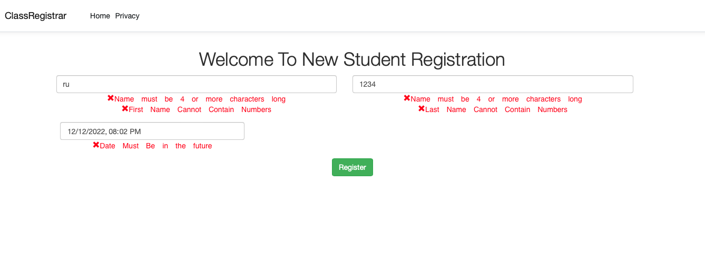
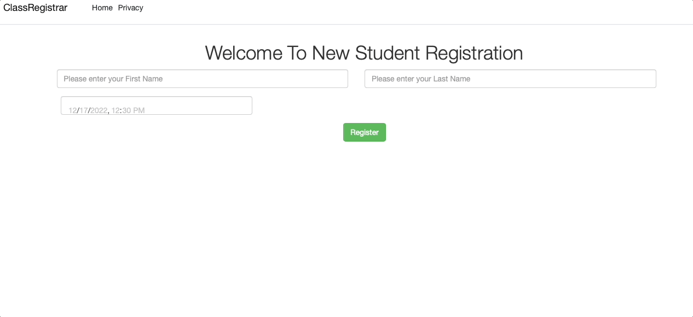
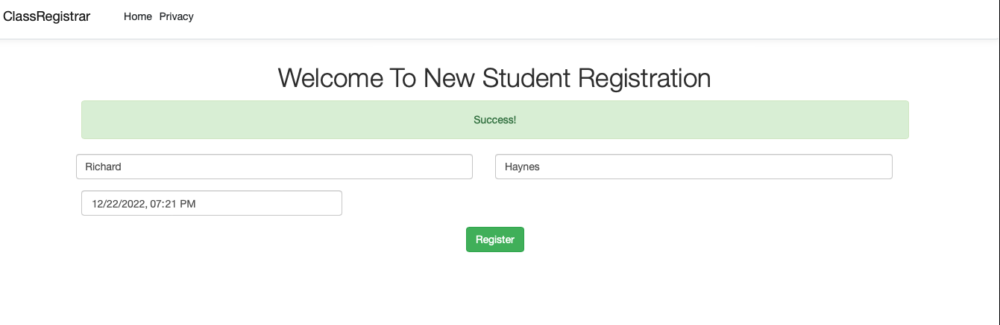
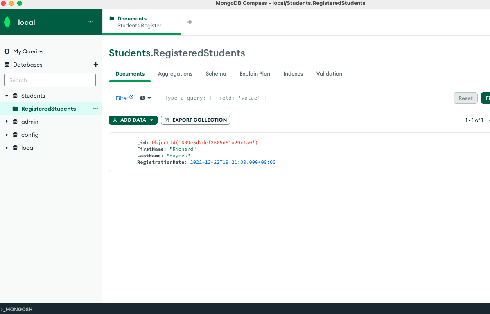

# Form Validation and Error Handling
In my experience Javascript still has a lot more flexibility when it comes to simple yet reasonable form validation and error messaging. *Note* As with all conversations about data validations validation of data should occur in multiple places i.e front-end, back-end,databases etc. You will notice that while this article will focus on front-end based validation there is still back-end validation going on as well. Now moving on from that warning.

Microsoft has provided very convient and powerful data validation in the form of the Data Annotations in the System.ComponentModel.DataAnnotations library and Razor pages have natural ways to enforce these even as a form get submitted. They however lack a lot of flexibility in display and styling when it comes to presentation of the error messages for one and more importantly they require a lot of additional work to make more complicated logical validation.
## Form Validation
To demonstrate this we are going to work on a very basic student college registration application. We will be applying to a college (not named in this example) and will be providing simply our first and last name as well as the date we'd like to apply. For the purposes of our application however it makes no sense for us as a user to be able to apply at any point in the past. This will by no means apply to all systems as many applications can be back dated but for our use case lets assume that is indeed a business requirement.

Below you can see we have a very simple Index.cshtml file that is our main view. This view has very little Javascript inside itself to keep our code well organized. It adds a simple event handler to a button and calls a method named registerStudent providing it the url we want to call and a json object containg our forms data.
```C#
@{
    #region
    // https://learn.microsoft.com/en-us/aspnet/core/tutorials/web-api-javascript?view=aspnetcore-7.0
    // https://blog.sessionstack.com/how-javascript-works-the-different-ways-of-declaring-a-function-5-best-practices-8a0324c06fe2
    // https://www.geeksforgeeks.org/moment-js-using-with-browser/
    // https://www.webfx.com/blog/web-design/javascript-dates-moment-js/
    // https://blog.jscrambler.com/a-momentjs-in-time
    // https://www.vitoshacademy.com/javascript-create-ul-and-li-elements-with-js-with-chained-function/
    #endregion
    ViewData["Title"] = "Home Page";
}
<link rel="stylesheet" href="https://maxcdn.bootstrapcdn.com/bootstrap/3.4.0/css/bootstrap.min.css">
<script src="https://ajax.googleapis.com/ajax/libs/jquery/3.6.1/jquery.min.js"></script>
<script src="https://maxcdn.bootstrapcdn.com/bootstrap/3.4.0/js/bootstrap.min.js"></script>
<div class="text-center">
    <h1 class="display-4">Welcome To New Student Registration</h1>
    <div id="loadingSpinnerId" class="spinner-grow text-warning" role="status" hidden>
        <span class="sr-only">Loading...</span>
    </div>
    <div id="errorAlertId" class="alert alert-danger" role="alert" hidden>
        Ooops Something Went Wrong!
    </div>

    <div id="successAlertId" class="alert alert-success" role="alert" hidden>
        Success!
    </div>

</div>

<div id="errorsListId" style="color:#FF0004;">

</div>
<div class="text-center">
    <form method="post">
        <div class="row">
            <div class="row">
                <div class="col-md-6">
                    <div class="form-group">
                        <input id="firsNameId" type="text" name="name" class="form-control" placeholder="Please enter your First Name" required="required">
                        <div id="firstNameErrors" hidden>
                            <span id="firstNameLengthError" class="glyphicon glyphicon-remove" style="color:#FF0004;">Name must be 4 or more characters long</span>
                            <span id="firstNameNumbersError" class="glyphicon glyphicon-remove" style="color:#FF0004;">First Name Cannot Contain Numbers</span>
                        </div>
                    </div>
                </div>
                <div class="col-md-6">
                    <div class="form-group">
                        <input id="lastNameId" type="text" name="surname" class="form-control" placeholder="Please enter your Last Name" required="required">
                        <div id="lastNameErrors" hidden>
                            <span id="lastNameLengthError" class="glyphicon glyphicon-remove" style="color:#FF0004;">Name must be 4 or more characters long</span>
                            <span id="lastNameNumbersError" class="glyphicon glyphicon-remove" style="color:#FF0004;">Last Name Cannot Contain Numbers</span>
                        </div>
                    </div>
                </div>
            </div>
            <div class="col-md-4">
                <div class="form-group">
                    <input type="datetime-local" id="registrationDateId" class="form-control" value="@DateTime.Now" />
                    <span id="dateError" class="glyphicon glyphicon-remove" style="color:#FF0004;" hidden>Date Must Be in the future</span>
                </div>
            </div>
        </div>
        <div>
            <button type="submit" class="btn btn-success" id="btnRegister">Register</button>
        </div>
    </form>
</div>

@section scripts{
    <script defer>
        let RegistrationUrl = '@Url.ActionLink("Register", "Registration")';
    let registerButtonElement = document.getElementById('btnRegister');

        registerButtonElement.addEventListener('click', function (event) {
            event.preventDefault();
            let student = {
                firstName: document.getElementById('firsNameId').value,
                lastName: document.getElementById('lastNameId').value,
                registrationDate: document.getElementById('registrationDateId').value,
            };
            registerStudent(RegistrationUrl, student);
    });

    </script>
}

```
The registerStudent method is defined in our site.js file and as you can see it is also in itself quite simple in that is has only 2 work streams, calling a method to validate the student's form data and calling a method to submit the form if its found to be valid.

```Javascript
let registerStudent = function (url, student) {
    let studentValid = validateStudent(student);

    if (studentValid) {
        register(url, student);
    }
};
```
The validateStudent is the first chunk of code where going to discuss that does have a lot of work to do. This function is going to act on our business logic that is used to determine if the registration is valid. The first and last name have the same logical validations in our use case and could have been there own function themselves but for the sake of time we're going to keep them duplicated. As you can see were are just checking that both names are more than 4 characters which is just an arbritary number determined for the example and makes sure no numbers are sent in the form since most human's don't have numbers in their first and last names.

More importantly however you can see how we are using the javascript moment library to get the current date and time and validating that the registration date isn't before this given moment.

```Javascript
let validateStudent = function (student) {
    let valid = true;
    let now = moment().format("YYYY-MM-DD HH:mm");
    let numbersRegex = /^[0-9]+$/;

    if (student.firstName === undefined
        || student.firstName.length < 4
        || String(student.firstName).match(numbersRegex)) {
        document.getElementById('firstNameErrors').removeAttribute('hidden');
        valid = false;
    }

    if (student.lastName === undefined || student.lastName.length < 4
        || String(student.lastName).match(numbersRegex)) {
        document.getElementById('lastNameErrors').removeAttribute('hidden');
        valid = false;
    }

    if (student.registrationDate < now) {
        document.getElementById('dateError').removeAttribute('hidden');
        valid = false;
    }

    return valid;
};
```
If any of the if blocks in the above snippet is hit you will as user see any of the below errors messages.


As a recap yes none of the code written above couldn't have been written in C# but we have to take into consideration what that means. If we only rely on C# for validation then only requests made to the server code will prevent bad data from being entered or saved. I find it's a much healthier system when Javascript is used to prevent sending bad data to the bad end altogether. It cuts down on the amount of time in displaying error messages back to a user the faster they are corrected in regards to bad data they faster they can correct it.

### Back End Error Handling
This section has the potential to hurt the feelings of back end devs of all languages but we are often way to comfortable with our built in error handling tools that we never consider how those are presented. The ability to throw exceptions for example is one of the most commonly misused techniques when writing back end code. Exceptions are very resource intensive tools designed to hault an application to prevent bad data input. Improper error handling can hault an application in a situation where in all actuality the end user could correct the issue if there page didn't crash.

Even worse improper error handling can expose highly senstive technical details about a companies source code if not caught. [Error Handling](https://cheatsheetseries.owasp.org/cheatsheets/Error_Handling_Cheat_Sheet.html) is reguarly on the [OWASP top 10](https://owasp.org/www-project-proactive-controls/v3/en/c10-errors-exceptions) list as common security flaws.

Believe it or not but Javascripts nature of not showing errors can be very helpful when it comes to simple steps to keeping sensitive information safe. Of course the developer console is always able to be used to get errors but still every little bit helps. More importantly however instead of throwing exceptions it might make more sense to merely return error message collections to a front end that can more gracefully handle them and can create situations where customers can either patiently wait for a remedy or contact technical support agents.

To demonstrate this in detail we are going to hook up our web application to a MongoDb database in order to act as our datastore for our registered students. The below code snippet uses tuples to return a boolean to represent successful access of our Mongo database and a collection of strings to store any error messages we want to transport back to our front end.
```C#
using System;
using ClassRegistrar.Models;
using ClassRegistrar.Models.Options;
using Microsoft.Extensions.Options;
using MongoDB.Driver;

namespace ClassRegistrar.Services
{
    #region
    /*
     * https://learn.microsoft.com/en-us/aspnet/core/tutorials/first-mongo-app?view=aspnetcore-7.0&tabs=visual-studio-mac
     * https://dev.to/sonyarianto/how-to-spin-mongodb-server-with-docker-and-docker-compose-2lef
     * https://www.bmc.com/blogs/mongodb-docker-container/
     * https://www.mongodb.com/try/download/shell
     * https://medium.com/@kristaps.strals/docker-mongodb-net-core-a-good-time-e21f1acb4b7b
     * https://earthly.dev/blog/mongodb-docker/
     * https://code-maze.com/csharp-catch-multiple-exceptions/
     */
    #endregion
    public sealed class StudentRegistrationService: IStudentRegistrationService
	{
        private readonly IMongoCollection<Student> _studentCollection;
        private readonly ILogger<StudentRegistrationService> _logger;
		public StudentRegistrationService(IOptionsMonitor<StudentDataStoreOptions> options
            , ILogger<StudentRegistrationService> logger)
		{
            _logger = logger;
            var mongoClient = new MongoClient(
            options.CurrentValue.ConnectionString);

            var mongoDatabase = mongoClient.GetDatabase(
                options.CurrentValue.DatabaseName);

            _studentCollection = mongoDatabase.GetCollection<Student>(
                options.CurrentValue.StudentsCollectionName);
        }

        public async Task<(bool, IEnumerable<string>)> RegisterAsync(Student student)
        {
            try
            {
                await _studentCollection.InsertOneAsync(student);
                return (true, new List<string>());
            }
            catch (Exception ex) when(ex is MongoDB.Driver.MongoCommandException)
            {
                // This exception can provide different information so we log its actions differently
                _logger.LogWarning("Command Exception Occured Check System Authorization: {error}", ex.Message);
                return (false, new List<string>
                {
                    "Please try this operation again"
                });
            }
            catch (Exception ex)
            {
                _logger.LogCritical("Unepexcted Error Occurred: {error}",ex.Message);
                return (false, new List<string>
                {
                    "An unexpected error occurred please try your operation again or contact support if this continues"
                });
            }
        }
    }
}


```

The consuming controller can act on this data and return to the consuming front end code controlled and specific information about the problem.

```C#
using System;
using System.Collections.Generic;
using System.Linq;
using System.Threading.Tasks;
using ClassRegistrar.Models;
using ClassRegistrar.Requests;
using ClassRegistrar.Services;
using Microsoft.AspNetCore.Http;
using Microsoft.AspNetCore.Mvc;

namespace ClassRegistrar.Controllers
{
    #region
    /*
     * https://learn.microsoft.com/en-us/aspnet/core/tutorials/first-mongo-app?view=aspnetcore-7.0&tabs=visual-studio-mac
     * https://dev.to/sonyarianto/how-to-spin-mongodb-server-with-docker-and-docker-compose-2lef
     * https://www.bmc.com/blogs/mongodb-docker-container/
     * https://www.mongodb.com/try/download/shell
     * https://medium.com/@kristaps.strals/docker-mongodb-net-core-a-good-time-e21f1acb4b7b
     */
    #endregion
    [Route("[controller]")]
    [ApiController]
    public class RegistrationController : ControllerBase
    {
        private readonly IStudentRegistrationService registrationService;
        public RegistrationController(IStudentRegistrationService registrationService)
        {
            this.registrationService = registrationService;
        }
        [HttpPost("Register")]
        public async Task<IActionResult> RegisterAsync([FromBody] RegistrationDto registration)
        {
            if (!ModelState.IsValid)
            {
                return BadRequest(new { error = "One or More Values Where InValid"});
            }
            (bool accessed, IEnumerable<string> errors) results = await registrationService.RegisterAsync((Student)registration);
            if (!results.accessed)
            {
                return StatusCode(StatusCodes.Status500InternalServerError, new { errors = results.errors });
            }
            return Ok();
        }
    }
}

```

The fetch call that posted to this controller will consume the returning json and pass that into a function called buildErrorList, written to display the list of back end errors as an unordered list.

```Javascript
let register = function (url, student) {
    //document.getElementById('loadingSpinnerId').removeAttribute('hidden');

    fetch(url, {
        method: 'POST',
        headers: {
            'Accept': 'application/json',
            'Content-Type': 'application/json'
        },
        body: JSON.stringify(student)
    }).then((response) => {
        //document.getElementById('loadingSpinnerId').setAttribute('hidden');
        if (response.status !== 200) {
            let json = response.json();
            return json;
        }
        else {
            document.getElementById('successAlertId').removeAttribute('hidden');
        }
    }).then((json) => {
        let errorMessage = json.error === undefined ? "Oops something went wrong" : json.error;
        let errorAlert = document.getElementById('errorAlertId');
        errorAlert.innerText = errorMessage;
        errorAlert.removeAttribute('hidden');
        buildErrorList(json.errors);
    } );
};
```

```Javascript
let buildErrorList = function (errors) {
    
    if (errors === undefined || errors === null || errors.length === 0) {
        return;
    }
    else {
        let errorsList = document.getElementById('errorsListId');
        let unorderedErrors = document.createElement('ul');
        errorsList.appendChild(unorderedErrors);

        errors.forEach(function (error) {
            let listItem = document.createElement('li');
            unorderedErrors.appendChild(listItem);
            listItem.innerHTML += error;

        });
    }

};
```
All of this works to provide us a system that can gracefully handle errors without crashing and can provide information that as developers have intention to be presented to our end user to give them accurate direction into what to do if errors arise. Many developers still underestimate the fact that many unhandled errors that occur are often outside of their control or are truly resolved via waiting just a few seconds before trying and action again. Many modern systems for example add purposefuly waits in between allowing requests to help addres DDOS attacks. 


In short please keep in mind that gracefully handling error messages does not need to be only a consideration of the back end code. Working in combination with the front end developers can create healthy user experiences for customers when systems fail.

### Success Images


